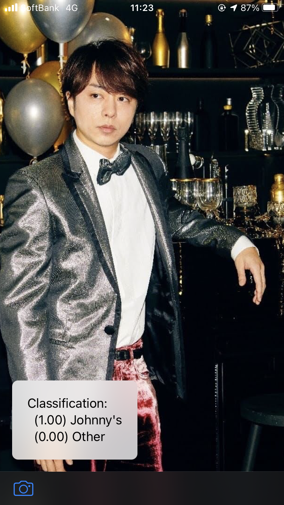
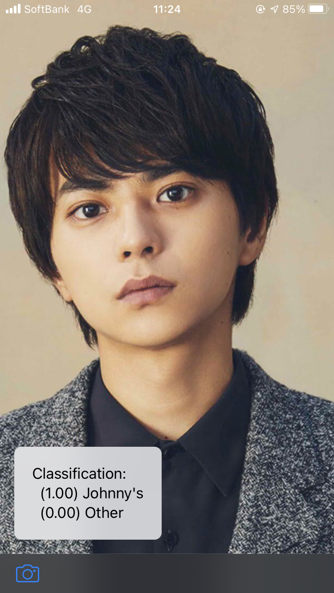
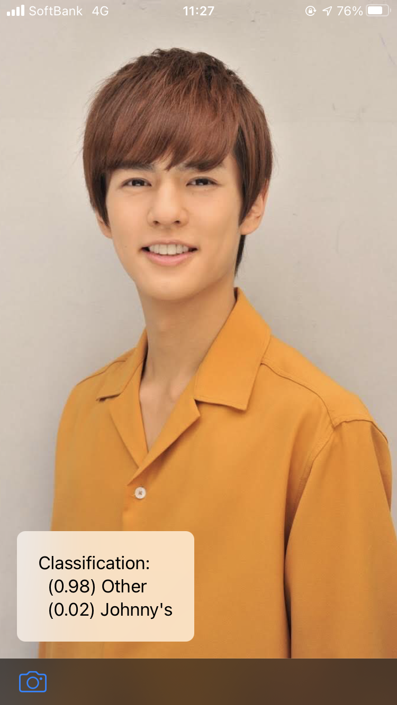

# JohnnyFace

This application can detect Johhny's face.

It is based on the Vision and Core ML sample code provided by Apple: [Classifying Images with Vision and Core ML](https://developer.apple.com/documentation/vision/classifying_images_with_vision_and_core_ml).

| |  |  |
|:-:|:-:|:-:|

## Requirements
- iOS 13.0+

## Model training

The machine learning model used in this application was trained using TensorFlow. The code used for the training can be found [here](https://github.com/Shakshi3104/isJohnnys).
